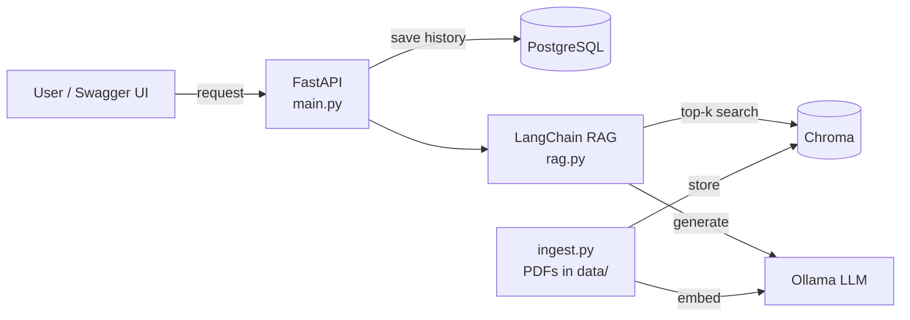

# DocuChat — RAG Chatbot API


DocuChat is a REST API that answers questions about your own PDF documents using **Retrieval-Augmented Generation (RAG)**. Every answer comes with its source file and page number, and questions outside the documents are politely declined instead of hallucinated.

## Features

- **Document Q&A with sources** — ask a question, get an answer grounded in your PDFs plus the pages it came from
- **Hallucination guard** — the prompt restricts the LLM to the retrieved context only
- **Chat history** — every conversation is stored in PostgreSQL per `session_id`
- **Fully containerized** — API and database start with a single `docker compose up`
- **CI pipeline** — every push and pull request is tested and built automatically with GitHub Actions

## Tech Stack

| Layer | Technology |
| --- | --- |
| API | Python, FastAPI, Pydantic |
| RAG orchestration | LangChain (LCEL) |
| LLM | Ollama — `qwen2.5:3b` |
| Embeddings | Ollama — `bge-m3` (multilingual, works well for Indonesian) |
| Vector store | Chroma |
| Database | PostgreSQL 16 |
| Infrastructure | Docker, Docker Compose |
| CI | GitHub Actions, pytest |

## Architecture



**Ingestion:** Load PDFs → split into chunks (1000 chars, 150 overlap) → embed with `bge-m3` → store in Chroma.
**Query:** Embed the question → retrieve top-4 chunks → add them to the prompt → generate the answer with `qwen2.5:3b`.

## API Endpoints

| Method | Endpoint | Description |
| --- | --- | --- |
| `GET` | `/health` | Health check |
| `POST` | `/api/v1/chat` | Ask a question about the documents |
| `GET` | `/api/v1/history/{session_id}` | Get the chat history of a session |

Example request:

```json
POST /api/v1/chat
{
  "session_id": "demo",
  "message": "What method was used in this research?"
}
```

Example response:

```json
{
  "answer": "The research compares five CNN architectures ...",
  "sources": [{ "file": "data/paper.pdf", "page": 3 }]
}
```

Status codes: `200` success · `400` empty message · `422` invalid request body · `503` LLM unavailable.

## Getting Started

### Prerequisites

- [Docker Desktop](https://www.docker.com/products/docker-desktop/)
- [Ollama](https://ollama.com/download)
- Python 3.11+ (only needed to run ingestion and tests locally)

### 1. Clone and pull the models

```bash
git clone https://github.com/VerindraHernandaPutra/docuchat.git
cd docuchat
ollama pull qwen2.5:3b
ollama pull bge-m3
```

### 2. Ingest your documents

Put your PDF files in the `data/` folder, then:

```bash
python -m venv venv
venv\Scripts\activate          # Windows
# source venv/bin/activate     # macOS/Linux
pip install -r requirements.txt
python ingest.py
```

This creates the `chroma_db/` vector store.

### 3. Configure environment variables

Create a `.env` file in the project root:

```
POSTGRES_PASSWORD=your_password
```

### 4. Run the app

```bash
docker compose up --build
```

Open **http://localhost:8000/docs** to try the API from the interactive Swagger UI.

> Ollama runs on the host machine. The API container reaches it through `host.docker.internal`. On Linux, start Ollama with `OLLAMA_HOST=0.0.0.0 ollama serve`.

## Running Tests

```bash
python -m pytest -v
```

The tests cover the health check and request validation, so they run without Ollama or a database — the same tests run in the CI pipeline.

## Project Structure

```
docuchat/
├── main.py               # FastAPI app and endpoints
├── rag.py                # RAG chain (retriever + prompt + LLM)
├── ingest.py             # PDF ingestion into Chroma
├── db.py                 # PostgreSQL chat history
├── tests/test_api.py     # API tests
├── Dockerfile
├── docker-compose.yml
└── .github/workflows/ci.yml
```

## Deploying to AWS (roadmap)

| Local component | AWS equivalent |
| --- | --- |
| Ollama (LLM + embeddings) | Amazon Bedrock |
| Chroma | Amazon OpenSearch or RDS PostgreSQL + pgvector |
| PostgreSQL container | Amazon RDS (private subnet) |
| `data/` PDFs + `ingest.py` | Amazon S3 + Lambda triggered on upload |
| API container | Amazon ECS on Fargate, image in Amazon ECR |
| `.env` | AWS Secrets Manager |
| `docker compose logs` | Amazon CloudWatch |

## Author

**Verindra Hernanda Putra** — Information Technology, Telkom University
